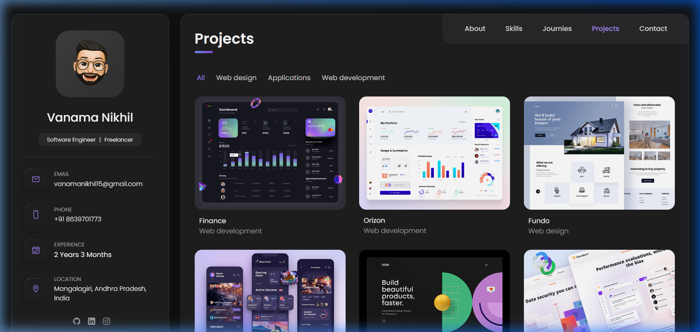

# V.Nikhil - Portfolio

A modern, responsive, and visually stunning professional portfolio website built with Vanilla HTML, CSS, and JavaScript. This project showcases my journey, skills, projects, and professional experience with a focus on enterprise-level aesthetics and smooth user interactions.

## 🚀 Features

- **Responsive Design:** Fully optimized for all screen sizes (mobile, tablet, desktop).
- **Modern UI/UX:** Sleek dark theme with glassmorphism, smooth gradients, and vibrant accents.
- **Dynamic Content:** Interactive sidebar, tabbed navigation, and animated skill categories.
- **AOS Animations:** Smooth scroll-triggered animations for a premium feel.
- **Enterprise Focused:** Highlighting skills and learning in the SAP ecosystem.

---

## 📸 Section Overview

### 👤 About Me
The introductory section provides a professional summary and highlights "What I'm doing," including Web Development, UI/UX Design, and Enterprise/SAP learning.


### 🛠️ Skills
A comprehensive breakdown of technical expertise across multiple categories:
- **Web Development:** HTML5, CSS3, React.js, Angular (v18+), GSAP.
- **Programming:** JavaScript, Python, Node.js.
- **Design:** Figma, UI/UX Principles, Spline.
- **Enterprise:** SAP Fundamentals, BTP, HANA.


### 🎓 Journies
A detailed timeline of my educational background and professional experience, showcasing growth from university to the corporate world.


### 📂 Projects
A curated gallery of my work, categorized by Web Design, Applications, and Web Development. Each project represents a unique challenge and solution.



### 📧 Contact
An interactive contact form and location map for seamless professional communication.


---

## 🛠️ Built With

- **HTML5 & CSS3:** Semantic structure and custom styling.
- **JavaScript (Vanilla):** Core logic and interactive elements.
- **Ionicons:** Premium open-source icons for UI.
- **AOS (Animate On Scroll):** Engagement-focused animations.
- **Google Fonts:** Poppins for elegant typography.

---

## 🔍 How it Works (Technical Details)

The portfolio is built with a custom-designed single-page architecture that prioritizes performance and smooth transitions.

### 🏗️ Architecture
- **Navigation Logic:** A custom `data-nav-link` system handles switching between different "pages" (articles) without reloading the browser.
- **Theme & Styling:** CSS variables are used for consistent dark-theme coloring, glassmorphism effects, and responsive layout calculations.
- **Animations:**
  - **AOS (Animate On Scroll):** Managed via `AOS.init()` to reveal sections elegantly as the user scrolls.
  - **CSS Transitions:** Micro-interactions (hover effects, button scales) are handled purely with hardware-accelerated CSS.

### 📱 Responsive Strategy
- Uses a mobile-first approach with flexible `rem` and `em` units.
- Sidebar collapses into a compact header on smaller screens using media queries.

---

## ⚙️ Installation & Cloning

If you'd like to use this portfolio as a template or study its architecture, you can clone it locally:

1. **Clone the repository:**
   ```bash
   git clone https://github.com/nikhilvanama/Portfolio.git
   ```
2. **Navigate to the project directory:**
   ```bash
   cd Portfolio
   ```
3. **Open `index.html`** in your preferred browser:
   - On Windows: `start index.html`
   - On macOS: `open index.html`
   - On Linux: `xdg-open index.html`

> [!CAUTION]
> **License & Usage:** This project is for personal use and education only. **It should NOT be sold or redistributed for commercial gain.** Please respect the original creator's work.

---

## 📂 Project Structure

```text
Portfolio/
├── assets/
│   ├── css/         # Custom stylesheets
│   ├── js/          # Main application logic
│   ├── images/      # UI icons, avatars, and project previews
│   └── screenshots/ # README documentation screenshots
├── index.html       # Main entry point
└── README.md        # Project documentation
```

Developed with ❤️ by [Vanama Nikhil](https://github.com/nikhilvanama)
