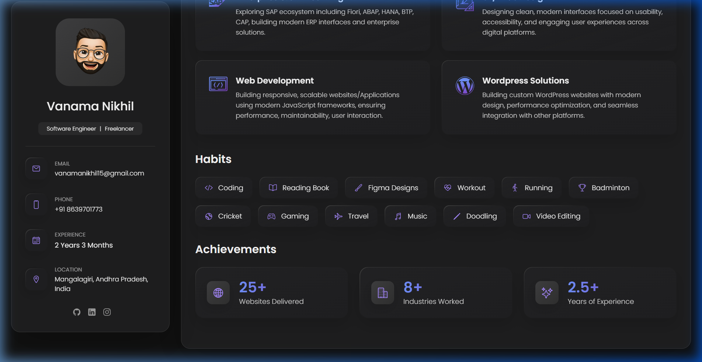
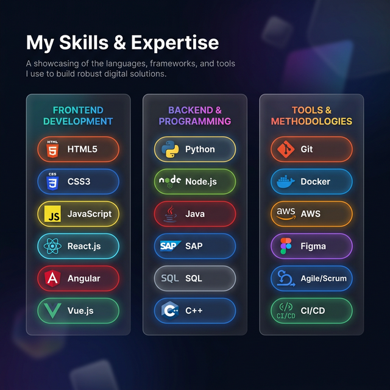
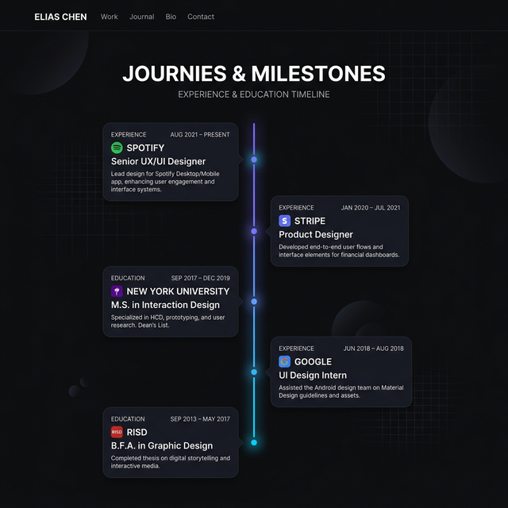
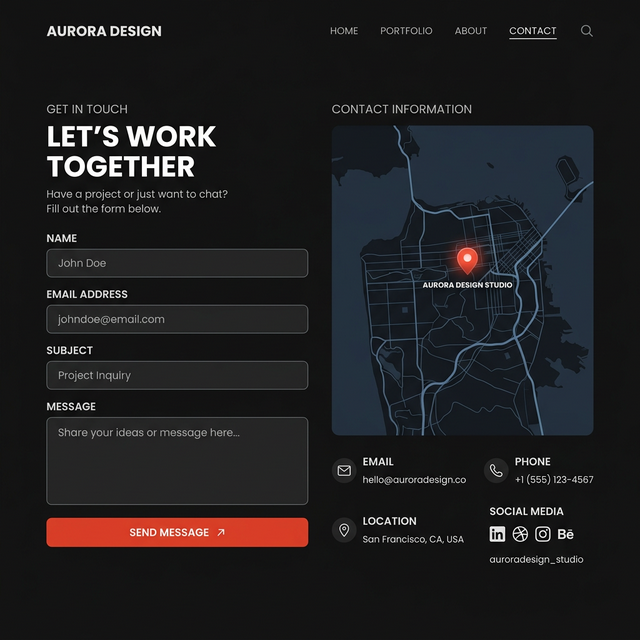

# V.Nikhil - Portfolio

[](https://vnikhil.vercel.app/)

A modern, responsive, and visually stunning professional portfolio website hosted on Vercel. This project showcases my journey, skills, projects, and professional experience with a focus on enterprise-level aesthetics, seamless animations, and a dynamic, data-driven architecture.

## 🚀 Key Features & Customizations

- **Dynamic Data Architecture:** The core content of the site (Services, Skills, Timelines, Certifications, etc.) is entirely decoupled from the HTML structure. Data is managed securely in `assets/js/data.js` and rendered dynamically using HTML5 `<template>` cloning, making content updates effortless.
- **Interactive 3D Philosophy Globe:** A custom CSS/JS implementation featuring a mouse-tracking, 3D tilting globe effect in the Philosophy wrapper.
- **Serverless AJAX Contact Form:** Fully functional contact form integrated with Formspree via the `fetch` API. It validates inputs manually (min-length, exact 10-digit boundaries for phone numbers) and processes submissions without page reloads.
- **Custom Toast Notifications:** Responsive, animated Toast UI system (dropping down from the top with glowing violet drop-shadows) to reflect success or validation errors upon form interaction.
- **Modern UI Components:** 
  - Floating Animated Resume Button with continuous gradient shine effects.
  - "Bento-Box" style internship timelines with custom styling.
- **AOS Animations:** Smooth scroll-triggered fade and zoom reveal animations for a premium feel.

## 🛠️ Built With

- **HTML5 & CSS3:** Semantic structure and custom styling incorporating glassmorphism and modern CSS linear-gradients.
- **JavaScript (Vanilla):** Core routing, template injection, 3D effects, scroll tracking, and AJAX form submissions.
- **Ionicons:** Premium open-source icons for UI.
- **AOS (Animate On Scroll):** Engagement-focused animations.
- **Google Fonts:** Poppins for elegant typography.

---

## 🔍 How it Works (Technical Architecture)

The portfolio is built with a custom-designed single-page architecture that prioritizes performance and maintainability.

### 🏗️ Data-Driven UI (The Template Engine)
Instead of hardcoding a massive `index.html` file, most repetitive structures utilize the `<template>` specification:
1. All unique content (job titles, descriptions, skills arrays, etc.) is strictly isolated in `assets/js/data.js`.
2. `script.js` clones semantic HTML snippets locally for each section.
3. Need to add a new project or update a certification? **You never need to touch the HTML.** Just add an object to the array in `data.js` and reload. 

### 📡 Contact Form System
Built carefully to prevent spam or accidental missends:
- Form button states visually lockdown upon submission. 
- Custom JS validates standard patterns (emails, names minimum length, strictly 10-digit mobile limits pre-filled with `.input-group` badges).
- Requests shoot to `Formspree` asynchronously; relying on promises to spawn tailored Error or Success localized Toasts dynamically injected into the DOM.

---

## ⚙️ Installation & Usage

If you'd like to use this portfolio format locally or study the underlying systems, you can clone it:

1. **Clone the repository:**
   ```bash
   git clone https://github.com/nikhilvanama/Portfolio.git
   ```
2. **Navigate to the project directory:**
   ```bash
   cd Portfolio
   ```
3. **Configure the Contact Form (Important):**
   - Create a free account at [Formspree](https://formspree.io/).
   - Start a new form and copy your unique Form ID.
   - Open `index.html`, find the `<form>` section (around line 790), and substitute the action URL endpoint: 
     `action="https://formspree.io/f/YOUR_UNIQUE_ID_HERE"`
4. **Modify Content Data:**
   - Head strictly into `assets/js/data.js` and replace the placeholder text strings, logic, and arrays with your own professional records. 

> [!CAUTION]
> **License & Usage:** This project is for personal use and education only. **It should NOT be sold or redistributed for commercial gain.** Please respect the original creator's work.

---

## 📂 Project Structure

```text
Portfolio/
├── assets/
│   ├── css/          # Custom stylesheets (style.css)
│   ├── js/           # Application logic (script.js) and Data models (data.js)
│   ├── documents/    # PDF assets (Resume, Certificates, Internships)
│   └── images/       # All UI icons, avatars, and backgrounds
│       └── screenshots/ # README documentation screenshots
├── index.html        # Single structural entry point & hidden templates
└── README.md         # Technical architecture definitions
```

---

## 📸 Section Overview

### 👤 About Me
The introductory section providing a summary and "What I'm doing." Entirely spawned dynamically by `data.js`.



### 🛠️ Skills
Comprehensive technical expertise breakdown constructed by nested loops sorting category arrays over the root JS.



### 🎓 Journeys / Timelines
Clean timelines capturing historical Professional Experience, Education, and custom "Bento-Box" Internships referencing external Document PDFs.



### 📧 Contact (AJAX & Toasts)
Robust verification input fields communicating instantly with isolated REST endpoints via JS interceptors.



---

Developed with ❤️ by [Vanama Nikhil](https://github.com/nikhilvanama)
